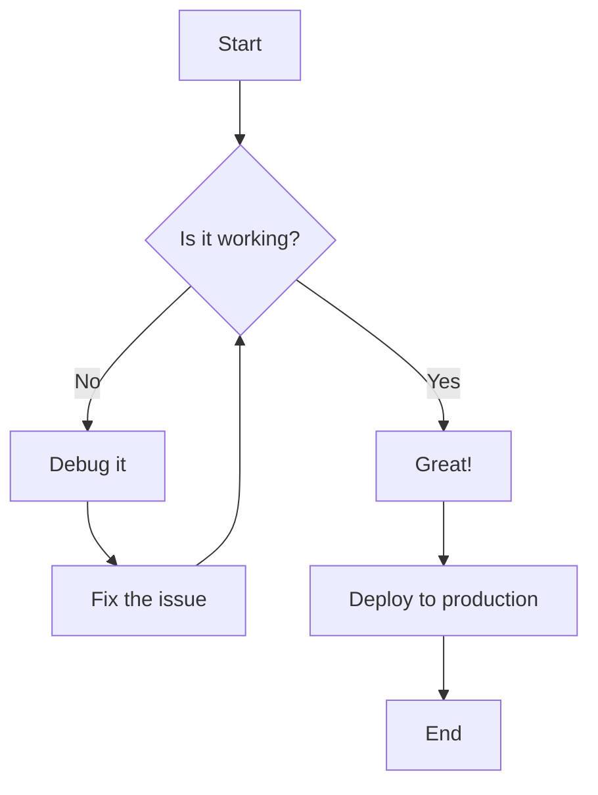
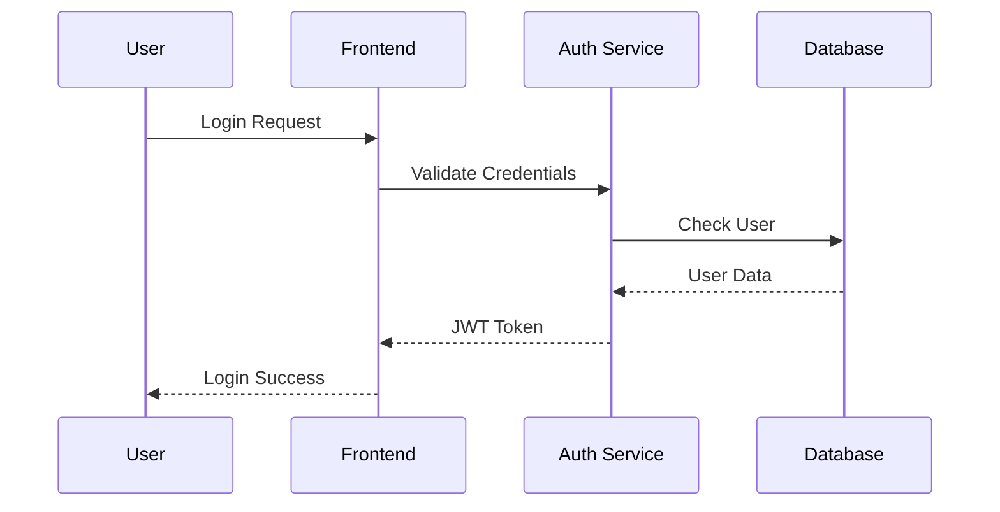
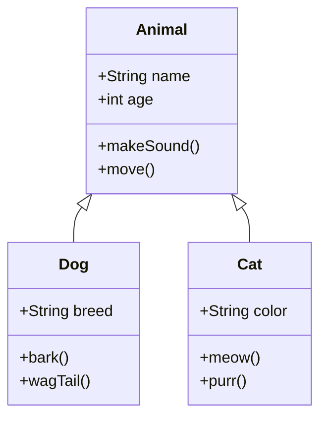
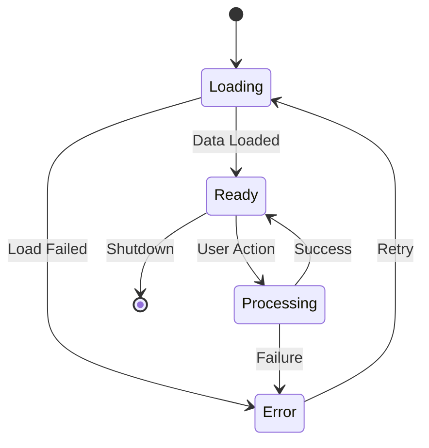
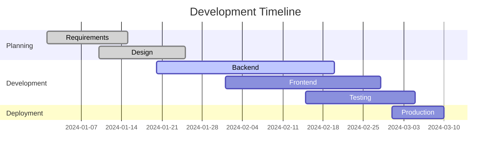

# Mermaid Diagrams Demo

This demo showcases the new Mermaid diagram support in md-show with comprehensive syntax highlighting.

## Flowchart Example

Here's a simple flowchart showing a decision process:



## Sequence Diagram

User authentication flow:



## Class Diagram

Basic OOP structure:



## State Diagram

Application states:



## Gantt Chart

Project timeline:



## Mixed Content with Code

You can also mix Mermaid diagrams with regular code blocks:

```python
def create_flowchart():
    """
    Generate a mermaid flowchart programmatically
    """
    diagram = """
    flowchart LR
        A[Python Script] --> B[Generate Diagram]
        B --> C[Render with Mermaid]
        C --> D[Display Result]
    """
    return diagram

# Usage
chart = create_flowchart()
print(chart)
```

## SQL Integration

SQL queries still work as before:

```sql
SELECT 
    name,
    COUNT(*) as total_diagrams,
    AVG(complexity) as avg_complexity
FROM 
    presentation_slides 
WHERE 
    diagram_type = 'mermaid'
GROUP BY 
    name
ORDER BY 
    total_diagrams DESC;
```

## JavaScript Code Example

And of course, other programming languages are highlighted perfectly:

```javascript
// Mermaid initialization
mermaid.initialize({
  startOnLoad: true,
  theme: 'default',
  flowchart: {
    useMaxWidth: true,
    htmlLabels: true
  }
});

// Render all diagrams
document.addEventListener('DOMContentLoaded', () => {
  mermaid.init(undefined, '.mermaid');
});
```

## Features Summary

- ✅ **Comprehensive Language Support**: JavaScript, Python, Ruby, Go, Rust, SQL, and many more
- ✅ **Mermaid Diagrams**: Flowcharts, sequence diagrams, class diagrams, state diagrams, Gantt charts
- ✅ **Interactive Features**: Click to zoom, copy source, download SVG
- ✅ **Presentation Mode**: Perfect rendering in slide presentation format
- ✅ **Auto-detection**: Smart language detection for unlabeled code blocks
- ✅ **Beautiful Styling**: Modern, professional appearance with syntax highlighting
